# Architecture Diagram - CollabCanvas MVP

**Project:** CollabCanvas  
**Version:** 1.0

---

## System Architecture Overview

CollabCanvas uses a hybrid Firebase architecture with React/Konva frontend to achieve real-time collaborative canvas functionality with optimal performance.

---

## High-Level Architecture

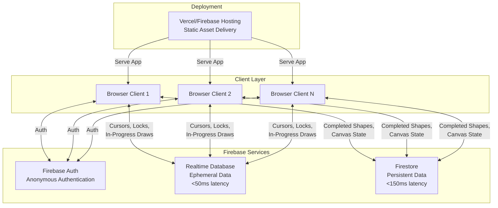

---

## Data Flow Architecture

```mermaid
graph LR
    subgraph "User Actions"
        MouseMove[Mouse Move]
        StartDraw[Start Drawing]
        DuringDraw[During Draw]
        CompleteDraw[Complete Draw]
        StartDrag[Start Drag Shape]
        DuringDrag[During Drag]
        CompleteDrag[Complete Drag]
    end
    
    subgraph "Local State"
        ReactState[React State<br/>useState/useRef]
        KonvaStage[Konva Stage<br/>Canvas Rendering]
    end
    
    subgraph "Firebase Realtime DB"
        Cursors[/presence/{userId}/cursor]
        TempShapes[/temp-shapes/{shapeId}]
        Locks[/locks/{shapeId}]
    end
    
    subgraph "Firebase Firestore"
        Shapes[canvases/{id}/shapes]
        Metadata[canvases/{id}/metadata]
    end
    
    MouseMove -->|Throttled 30fps| Cursors
    Cursors -->|Real-time Sync| ReactState
    
    StartDraw -->|Create temp| TempShapes
    DuringDraw -->|Update position/size| TempShapes
    CompleteDraw -->|Save final| Shapes
    CompleteDraw -->|Delete temp| TempShapes
    
    StartDrag -->|Acquire| Locks
    StartDrag -->|Create temp position| TempShapes
    DuringDrag -->|Update position| TempShapes
    CompleteDrag -->|Save final| Shapes
    CompleteDrag -->|Release| Locks
    CompleteDrag -->|Delete temp| TempShapes
    
    ReactState -->|Render| KonvaStage
    Shapes -->|Subscribe| ReactState
    TempShapes -->|Subscribe| ReactState
    Locks -->|Subscribe| ReactState
```

---

## Component Architecture

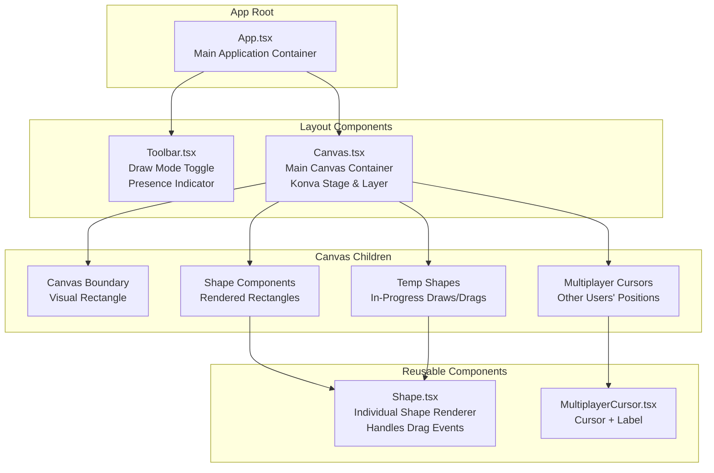

---

## State Management Architecture

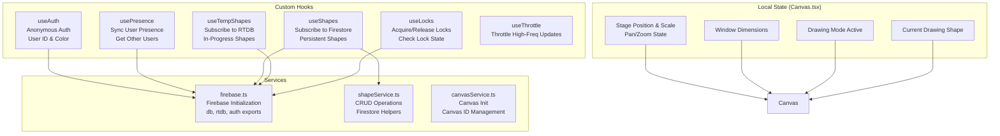

---

## Firebase Data Structure

```mermaid
graph TB
    subgraph "Firestore (Persistent)"
        FS_Root[Firestore Root]
        FS_Canvases[canvases/]
        FS_Canvas[canvasId]
        FS_Metadata[metadata:<br/>createdAt, lastModified]
        FS_Shapes[shapes/ subcollection]
        FS_Shape[shapeId:<br/>id, type, x, y,<br/>width, height, fill,<br/>createdBy, timestamps]
        
        FS_Root --> FS_Canvases
        FS_Canvases --> FS_Canvas
        FS_Canvas --> FS_Metadata
        FS_Canvas --> FS_Shapes
        FS_Shapes --> FS_Shape
    end
    
    subgraph "Realtime Database (Ephemeral)"
        RT_Root[Realtime DB Root]
        RT_Canvases[canvases/]
        RT_Canvas[canvasId/]
        RT_Presence[presence/]
        RT_User[userId:<br/>userId, color,<br/>cursor: x y,<br/>timestamp, isActive]
        RT_TempShapes[temp-shapes/]
        RT_TempShape[shapeId:<br/>id, type, x, y,<br/>width, height, fill,<br/>isInProgress, userId]
        RT_Locks[locks/]
        RT_Lock[shapeId:<br/>userId, timestamp,<br/>shapeId]
        
        RT_Root --> RT_Canvases
        RT_Canvases --> RT_Canvas
        RT_Canvas --> RT_Presence
        RT_Canvas --> RT_TempShapes
        RT_Canvas --> RT_Locks
        RT_Presence --> RT_User
        RT_TempShapes --> RT_TempShape
        RT_Locks --> RT_Lock
    enddAt, lastModified]
        FS_Shapes[shapes/ subcollection]
        FS_Shape[{shapeId}:<br/>id, type, x, y,<br/>width, height, fill,<br/>createdBy, timestamps]
        
        FS_Root --> FS_Canvases
        FS_Canvases --> FS_Canvas
        FS_Canvas --> FS_Metadata
        FS_Canvas --> FS_Shapes
        FS_Shapes --> FS_Shape
    end
    
    subgraph "Realtime Database (Ephemeral)"
        RT_Root[⚡ Realtime DB Root]
        RT_Canvases[canvases/]
        RT_Canvas[{canvasId}/]
        RT_Presence[presence/]
        RT_User[{userId}:<br/>userId, color,<br/>cursor: {x, y},<br/>timestamp, isActive]
        RT_TempShapes[temp-shapes/]
        RT_TempShape[{shapeId}:<br/>id, type, x, y,<br/>width, height, fill,<br/>isInProgress, userId]
        RT_Locks[locks/]
        RT_Lock[{shapeId}:<br/>userId, timestamp,<br/>shapeId]
        
        RT_Root --> RT_Canvases
        RT_Canvases --> RT_Canvas
        RT_Canvas --> RT_Presence
        RT_Canvas --> RT_TempShapes
        RT_Canvas --> RT_Locks
        RT_Presence --> RT_User
        RT_TempShapes --> RT_TempShape
        RT_Locks --> RT_Lock
    end
```

---

## User Interaction Flow Diagrams

### Flow 1: Canvas Pan & Zoom

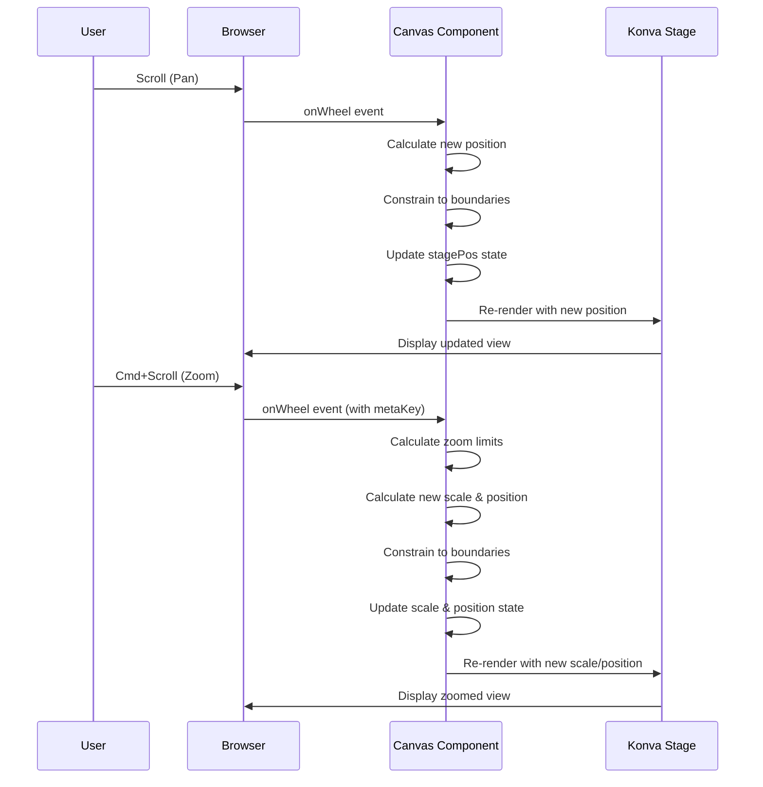

### Flow 2: Drawing a Rectangle

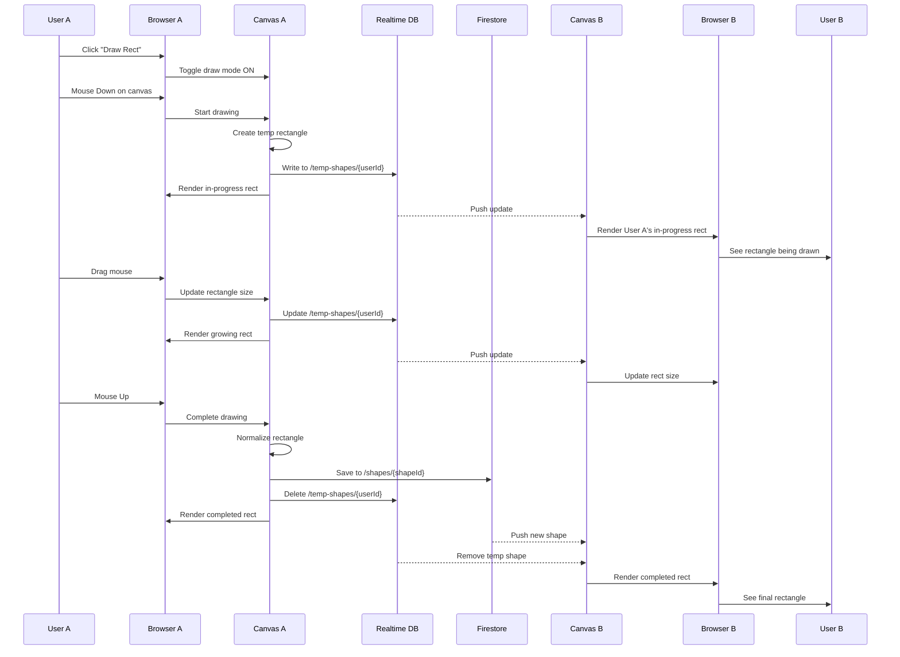

### Flow 3: Repositioning a Shape (with Locking)

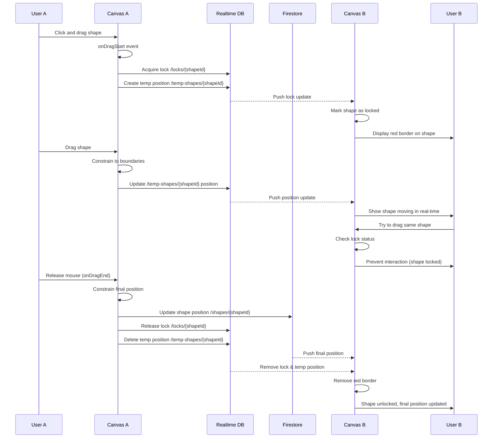

### Flow 4: User Presence & Cursor Sync

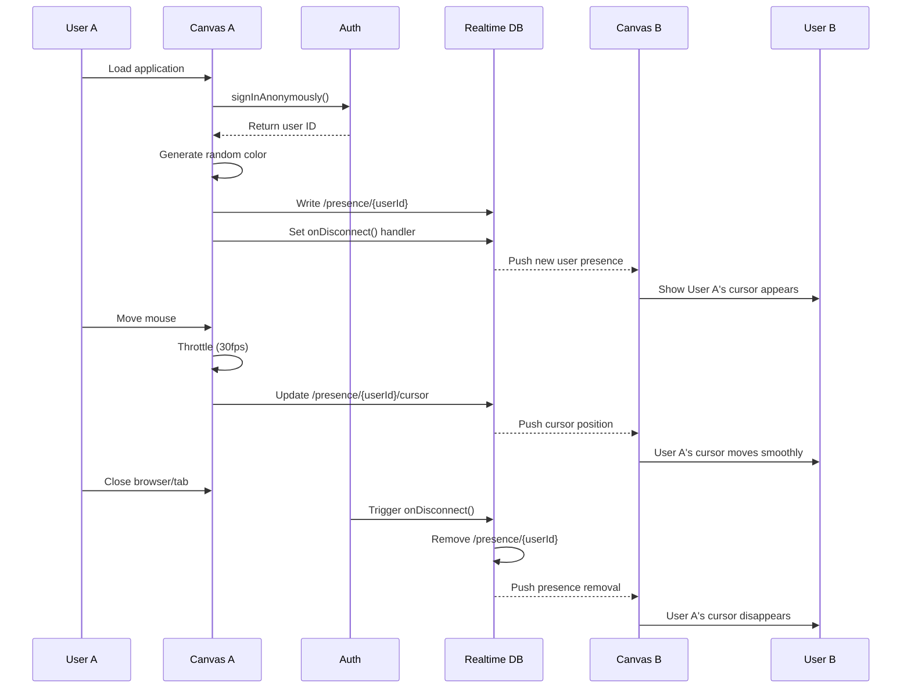

---

## Performance Optimization Strategy

```mermaid
graph TB
    subgraph "Frontend Optimizations"
        Throttle[Throttle Cursor Updates<br/>30fps instead of 60fps]
        Memo[React.memo on Shape Component<br/>Prevent unnecessary re-renders]
        UseMemo[useMemo for Calculations<br/>Zoom limits, constraints]
        Layers[Konva Layers<br/>Separate static/dynamic content]
        PerfDraw[perfectDrawEnabled: false<br/>Faster rendering]
    end
    
    subgraph "Firebase Optimizations"
        BatchWrites[Batch Firestore Writes<br/>Reduce network calls]
        IndexedData[Indexed Queries<br/>Fast shape retrieval]
        RTDB_Speed[Realtime DB for High-Freq<br/>Sub-50ms latency]
        Offline[Offline Persistence<br/>Reduce network dependency]
    end
    
    subgraph "State Management"
        LocalFirst[Optimistic Updates<br/>Update local immediately]
        Cleanup[Proper Cleanup<br/>useEffect return functions]
        Batching[React Batching<br/>Group state updates]
    end
    
    subgraph "Performance Targets"
        FPS[60 FPS maintained]
        CursorLatency[Cursor sync &lt;50ms]
        ShapeLatency[Shape sync &lt;100ms]
        Scale[500+ shapes, 5+ users]
    end
    
    Throttle --> CursorLatency
    Memo --> FPS
    UseMemo --> FPS
    Layers --> FPS
    PerfDraw --> FPS
    
    RTDB_Speed --> CursorLatency
    BatchWrites --> ShapeLatency
    IndexedData --> ShapeLatency
    
    LocalFirst --> FPS
    LocalFirst --> CursorLatency
    Cleanup --> FPS
    Batching --> FPS
    
    CursorLatency --> Scale
    ShapeLatency --> Scale
    FPS --> Scale
```

---

## Technology Stack Detail

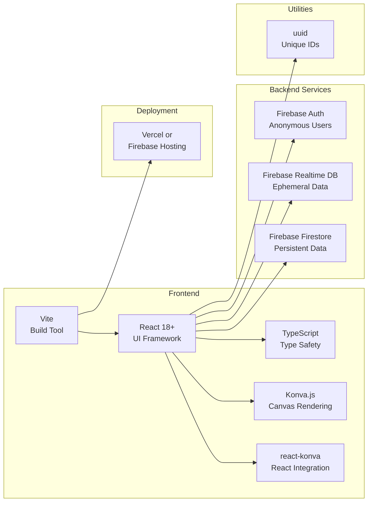

---

## Folder Structure

```
collab-canvas/
├── project_scaffolding/         # Project planning documents
│   ├── PRD.md                   # Product Requirements Document
│   ├── TASK_LIST.md             # Development task list
│   └── ARCHITECTURE.md          # This file - system architecture
│
├── public/                      # Static assets
├── src/
│   ├── components/              # React components
│   │   ├── Canvas.tsx          # Main canvas container
│   │   ├── Shape.tsx           # Individual shape renderer
│   │   ├── MultiplayerCursor.tsx  # Cursor component
│   │   └── Toolbar.tsx         # Top toolbar
│   │
│   ├── hooks/                   # Custom React hooks
│   │   ├── useAuth.ts          # Anonymous authentication
│   │   ├── usePresence.ts      # User presence system
│   │   ├── useShapes.ts        # Firestore shapes subscription
│   │   ├── useTempShapes.ts    # Realtime DB temp shapes
│   │   ├── useLocks.ts         # Shape locking system
│   │   └── useThrottle.ts      # Throttle utility
│   │
│   ├── services/                # Firebase and API services
│   │   ├── firebase.ts         # Firebase initialization
│   │   ├── shapeService.ts     # Shape CRUD operations
│   │   └── canvasService.ts    # Canvas initialization
│   │
│   ├── types/                   # TypeScript type definitions
│   │   ├── canvas.ts           # Canvas types
│   │   ├── shape.ts            # Shape types
│   │   ├── user.ts             # User types
│   │   └── presence.ts         # Presence types
│   │
│   ├── utils/                   # Utility functions
│   │   ├── shapeHelpers.ts     # Shape creation/manipulation
│   │   ├── constraints.ts      # Boundary constraint logic
│   │   └── colors.ts           # Color generation
│   │
│   ├── App.tsx                  # Root component
│   ├── main.tsx                 # Entry point
│   └── vite-env.d.ts           # Vite types
│
├── .env                         # Environment variables (gitignored)
├── .env.example                 # Environment template
├── .gitignore
├── package.json
├── tsconfig.json
├── vite.config.ts
└── README.md
```

---

## Security Considerations

### Firebase Security Rules

**Firestore (Test Mode - Acceptable for MVP):**
```javascript
rules_version = '2';
service cloud.firestore {
  match /databases/{database}/documents {
    match /{document=**} {
      allow read, write: if true;
    }
  }
}
```

**Realtime Database (Test Mode - Acceptable for MVP):**
```json
{
  "rules": {
    ".read": true,
    ".write": true
  }
}
```

### Production Security (Future Enhancement)

For production deployment beyond MVP, implement:
- Authenticated users only
- User can only write their own presence
- Shape writes require authentication
- Lock validation (user owns the lock)
- Rate limiting to prevent abuse

---

## Deployment Architecture

```mermaid
graph TB
    subgraph "Development"
        Dev[Local Development<br/>npm run dev<br/>localhost:5173]
    end
    
    subgraph "Build Process"
        Build[npm run build<br/>Vite Production Build]
        Assets[Static Assets<br/>dist/ folder<br/>HTML, CSS, JS, Images]
    end
    
    subgraph "Hosting Platform"
        Vercel[Vercel or Firebase Hosting<br/>CDN Distribution<br/>HTTPS Enabled]
    end
    
    subgraph "Firebase Backend"
        FBServices[Firebase Services<br/>Auth, Firestore, RTDB<br/>Always Available]
    end
    
    subgraph "Users"
        Users[Global Users<br/>Access via HTTPS]
    end
    
    Dev --> Build
    Build --> Assets
    Assets --> Vercel
    Vercel --> Users
    Users <--> FBServices
```

---

## Scalability Considerations

### Current Architecture Supports:
- **Users:** 5-10 concurrent users comfortably
- **Shapes:** 500+ shapes without performance degradation
- **Latency:** <50ms for cursors, <100ms for shapes
- **Data Size:** Limited by Firebase free tier quotas

### Future Scaling Strategies:
1. **Horizontal Scaling:**
   - Multiple canvas rooms (multi-tenancy)
   - Partition by canvas ID
   - Independent Firestore documents per canvas

2. **Performance Optimization:**
   - Implement virtual scrolling for large shape counts
   - Use Konva's caching for static shapes
   - Lazy load shapes outside viewport

3. **Backend Optimization:**
   - Implement Firebase indexes for complex queries
   - Use Cloud Functions for server-side validation
   - Upgrade to Firebase paid tier for higher quotas

4. **Network Optimization:**
   - Implement delta sync (only send changes)
   - Compress large payloads
   - Use Firebase's built-in offline persistence

---

## Error Handling Strategy

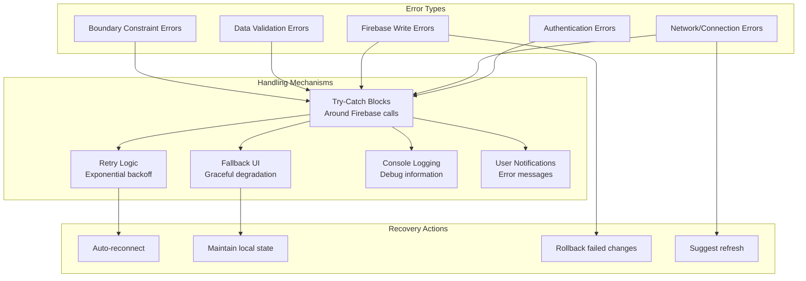

---

## Testing Strategy

### Unit Testing (Future Enhancement)
- Utility functions (constraints, helpers)
- Shape creation/normalization
- Throttle/debounce logic

### Integration Testing
- Canvas pan/zoom behavior
- Shape drawing and persistence
- Multi-user synchronization
- Lock acquisition and release

### Manual Testing Checklist
- ✅ Single user interaction
- ✅ Multi-user real-time sync
- ✅ Performance under load (500+ shapes)
- ✅ Network disconnection handling
- ✅ Browser compatibility
- ✅ Different screen sizes

---

## Key Design Decisions

### Why Hybrid Firebase Architecture?

**Decision:** Use Realtime Database for ephemeral data + Firestore for persistent data

**Rationale:**
- Realtime DB provides <50ms latency for cursors (critical UX)
- Firestore offers better structure for persistent shapes
- Separates concerns: temporary vs. permanent data
- Optimizes costs: ephemeral data auto-deleted

### Why Konva.js?

**Decision:** Use Konva.js instead of raw Canvas API or SVG

**Rationale:**
- High-performance canvas rendering (60 FPS)
- Built-in shape primitives and event handling
- Layer system for optimization
- React integration via react-konva
- Easier than raw Canvas, faster than SVG

### Why Optimistic Updates?

**Decision:** Update local state immediately, sync to Firebase in background

**Rationale:**
- Maintains 60 FPS regardless of network latency
- Better user experience (instant feedback)
- Rollback rarely needed (low conflict rate)
- Industry standard for collaborative apps

### Why Single Canvas for MVP?

**Decision:** All users share one canvas ("default-canvas")

**Rationale:**
- Simpler MVP implementation
- Easier testing and demonstration
- Reduces complexity in state management
- Easy to extend to multi-room later

---

## Future Architecture Enhancements

### Phase 2: AI Agent Integration (Post-MVP)

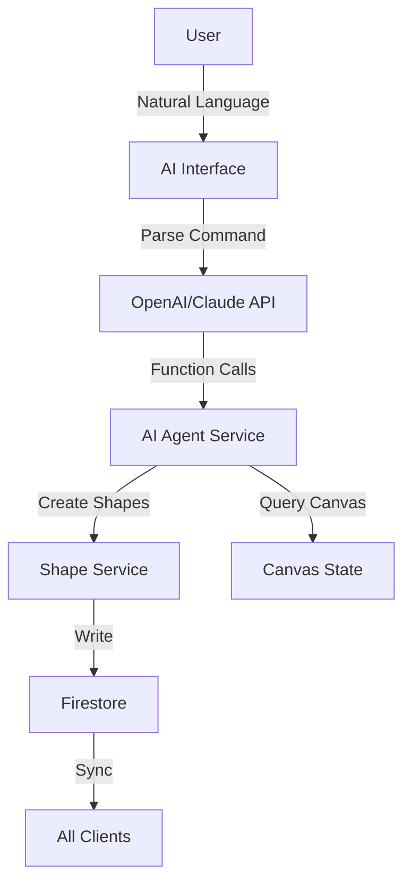

### Phase 3: Advanced Features

- Multi-room support with room codes
- Named user accounts with profiles
- Advanced shape types (circles, lines, text, images)
- Shape transformation tools (resize, rotate)
- Layer management and z-index
- Undo/redo with command pattern
- Export canvas to image/PDF
- Comments and annotations

---

## Monitoring & Observability

### Metrics to Track (Future)
- Real-time user count
- Average cursor sync latency
- Average shape sync latency
- Firebase read/write operations per second
- Canvas frame rate
- Error rates by type
- User session duration

### Tools
- Firebase Console for usage metrics
- Browser Performance API for FPS tracking
- Custom logging for debugging
- Sentry or similar for error tracking (future)

---

## Conclusion

This architecture provides a solid foundation for real-time collaborative canvas functionality while maintaining excellent performance and user experience. The hybrid Firebase approach optimally balances latency requirements with data persistence needs, and the modular component structure allows for future enhancements including AI agent integration.

---

**End of Architecture Document**