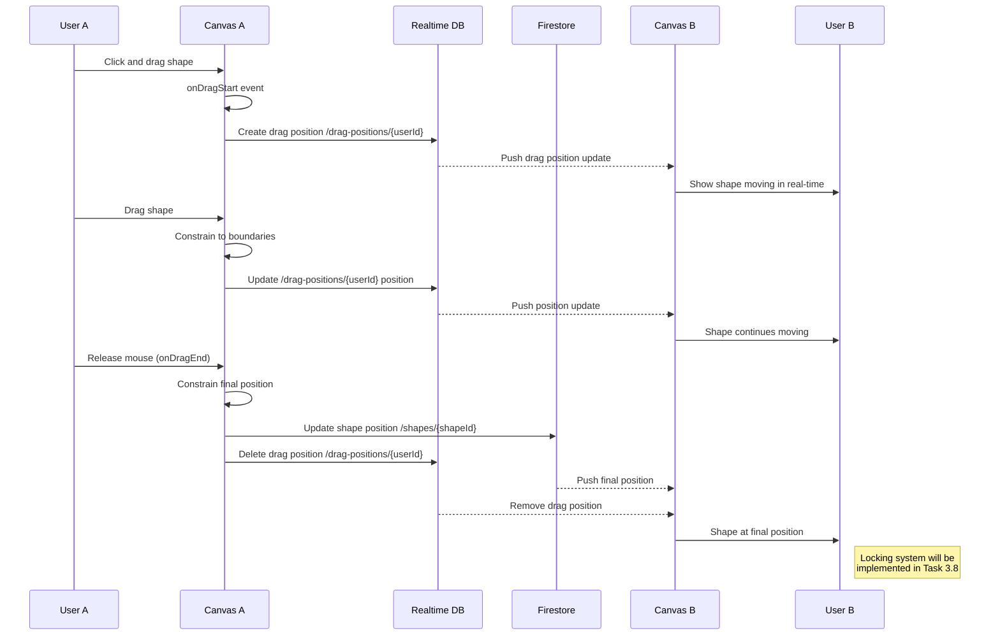

# Step-by-Step Refactoring Plan
## CollabCanvas MVP - Task 3.7 Alignment

**Goal:** Align ARCHITECTURE.md with actual codebase implementation through Task 3.7, and clean up any Task 3.8 code bleed.

---

## Phase 1: Audit Current State (Analysis Only)

### Step 1.1: Document All Task 3.8 Code in Codebase
**Action:** Create a list of all Task 3.8-related code currently in the project

**Checklist:**
- [ ] List all files with `isLocked` references
- [ ] List all files with lock-related logic
- [ ] List all red border / visual lock indicator code
- [ ] Identify any `useLocks` references (even if file doesn't exist)
- [ ] Document which components expect lock-related props

**Expected Output:** A markdown list showing:
```
Task 3.8 Code Found:
- src/components/ShapeComponent.tsx: isLocked prop, red border stroke
- src/components/Canvas.tsx: isBeingDragged checks, dragPositions filtering
- src/types/shape.ts: ShapeLock interface (defined but not used)
```

---

### Step 1.2: Document Architectural Divergences
**Action:** List all places where code differs from ARCHITECTURE.md

**Checklist:**
- [ ] Compare Realtime Database structure in ARCHITECTURE.md vs actual implementation
- [ ] Compare Data Flow diagrams vs actual code flow
- [ ] Note path differences (temp-shapes, drag-positions, locks)
- [ ] Identify any missing files that ARCHITECTURE expects
- [ ] Identify any extra files not in ARCHITECTURE

**Expected Output:** A table like:
```
| ARCHITECTURE.md Says | Actual Implementation | Status |
|---------------------|----------------------|--------|
| /temp-shapes/{shapeId} | /drag-positions/{userId} | Mismatch |
| /locks/{shapeId} | Not implemented | Missing (Task 3.8) |
```

---

## Phase 2: Choose Refactoring Strategy

### Step 2.1: Decision Point - Lock Implementation
**Action:** Decide how to handle Task 3.8 code bleed

**Options:**

**Option A: Remove All Task 3.8 Code** ⭐ RECOMMENDED
- Cleaner task separation
- PHASESUMMARY_3.1-3.7 claims Task 3.8 is remaining
- Easier to implement Task 3.8 properly later
- **Time:** ~30 minutes

**Option B: Keep Task 3.8 Code, Update Docs**
- Acknowledge partial implementation happened
- Update PHASESUMMARY to show Task 3.8 is partially complete
- Document what's missing (useLocks hook, full lock logic)
- **Time:** ~15 minutes (docs only)

**Option C: Complete Task 3.8 Fully**
- Implement missing `useLocks.ts` hook
- Complete lock acquisition/release flow
- Update all documentation
- **Time:** ~2-3 hours

**Decision:** Choose ONE option and document it

---

## Phase 3: Code Refactoring (If Option A Chosen)

### Step 3.1: Remove Lock Visual Indicators
**Action:** Remove red border and lock-related visual code

**Files to Modify:**

1. **src/components/ShapeComponent.tsx**
```typescript
// REMOVE:
- isLocked prop from interface
- isLocked parameter from function
- Conditional stroke color logic: stroke={isLocked ? '#ff0000' : '#000'}
- Conditional strokeWidth: strokeWidth={isLocked ? 3 : 1}
- draggable={!isLocked} condition (make always draggable)

// KEEP:
- All drag event handlers (onDragStart, onDragMove, onDragEnd)
- Base rectangle rendering
```

**Verification:** ShapeComponent should have no references to "lock"

---

### Step 3.2: Remove Lock Checking Logic
**Action:** Remove drag position filtering and lock checks

**Files to Modify:**

1. **src/components/Canvas.tsx**
```typescript
// REMOVE these lines (~line 225-235):
const isBeingDragged = Object.values(dragPositions).some(
  dragPos => dragPos.shapeId === shape.id
);

const dragPos = Object.values(dragPositions).find(
  dragPos => dragPos.shapeId === shape.id
);

const displayShape = dragPos ? { ...shape, x: dragPos.x, y: dragPos.y } : shape;

// SIMPLIFY the shape rendering to:
{shapes.map((shape) => {
  // Get drag position if this shape is being dragged by another user
  const dragPos = dragPositions[shape.id];
  const displayShape = dragPos ? { ...shape, x: dragPos.x, y: dragPos.y } : shape;
  
  return (
    <ShapeComponent
      key={shape.id}
      shape={displayShape}
      onDragStart={(shapeId) => startDrag(shapeId, shape.x, shape.y)}
      onDragMove={(shapeId, x, y, width, height) => updateDrag(shapeId, x, y, width, height)}
      onDragEnd={(shapeId, x, y, width, height) => endDrag(shapeId, x, y, width, height)}
    />
  );
})}
```

**Verification:** No lock-related logic in render loop

---

### Step 3.3: Update useDragPositions Hook
**Action:** Simplify to just return drag positions by shapeId

**File to Modify:** src/hooks/useDragPositions.ts

```typescript
// CHANGE return structure from:
// Record<string, DragPosition> keyed by userId

// TO:
// Record<string, DragPosition> keyed by shapeId

// UPDATE interface:
interface DragPosition {
  userId: string;  // Who is dragging
  shapeId: string;
  x: number;
  y: number;
  timestamp: number;
}

// UPDATE subscription logic to index by shapeId:
const filteredData: Record<string, DragPosition> = {};
Object.entries(data).forEach(([userId, position]) => {
  if (userId !== currentUserId) {
    const pos = position as DragPosition;
    filteredData[pos.shapeId] = pos;  // Index by shapeId, not userId
  }
});
```

**Verification:** dragPositions keyed by shapeId for easy lookup

---

### Step 3.4: Clean Up Type Definitions
**Action:** Keep ShapeLock type but mark as unused

**File to Modify:** src/types/shape.ts

```typescript
// ADD comment above ShapeLock:
/**
 * ShapeLock interface for Task 3.8 (Object Locking System)
 * Currently unused - will be implemented in Task 3.8
 */
export interface ShapeLock {
  userId: string;
  timestamp: number;
  shapeId: string;
}
```

**Verification:** Type exists but clearly marked as future use

---

## Phase 4: Documentation Updates

### Step 4.1: Update ARCHITECTURE.md - Firebase Data Structure
**Action:** Correct Realtime Database paths to match implementation

**File to Modify:** project_scaffolding/ARCHITECTURE.md

**Section:** "Firebase Data Structure" (around line 280)

```mermaid
# CHANGE THIS SECTION:

RT_TempShapes[temp-shapes/]
RT_TempShape[{shapeId}:<br/>id, type, x, y,<br/>width, height, fill,<br/>isInProgress, userId]

# TO:

RT_TempShapes[temp-shapes/]
RT_TempShape[{userId}:<br/>id, type, x, y,<br/>width, height, fill,<br/>isInProgress, userId]

# ADD NEW SECTION:

RT_DragPositions[drag-positions/]
RT_DragPos[{userId}:<br/>shapeId, x, y,<br/>timestamp, userId]

# UPDATE LOCKS SECTION:

RT_Locks[locks/]
RT_Lock[{shapeId}:<br/>userId, timestamp,<br/>shapeId]

# ADD COMMENT:
Note: locks/ path for Task 3.8 - not yet implemented
```

---

### Step 4.2: Update ARCHITECTURE.md - Data Flow
**Action:** Update "Flow 3: Repositioning a Shape" diagram

**File to Modify:** project_scaffolding/ARCHITECTURE.md

**Section:** "Flow 3: Repositioning a Shape (with Locking)" (around line 215)

**Change Title:** 
```
# FROM:
Flow 3: Repositioning a Shape (with Locking)

# TO:
Flow 3: Repositioning a Shape
```

**Update Sequence Diagram:**


**Verification:** Diagram shows actual drag flow without locks

---

### Step 4.3: Update ARCHITECTURE.md - Key Design Decisions
**Action:** Add section explaining architectural choices made

**File to Modify:** project_scaffolding/ARCHITECTURE.md

**Section:** Add new section under "Key Design Decisions" (around line 650)

```markdown
### Why drag-positions/{userId} instead of temp-shapes/{shapeId}?

**Decision:** Store in-progress drag positions keyed by userId rather than shapeId

**Rationale:**
- Each user can only drag one shape at a time (UI limitation)
- Simpler conflict resolution - one drag position per user
- Automatic cleanup via onDisconnect() on user path
- Clear ownership - position keyed by who is dragging, not what is being dragged
- userId key provides implicit lock-like behavior (user owns their drag slot)

**Trade-offs:**
- ✅ Simpler implementation for MVP
- ✅ Cleaner data structure
- ✅ Automatic cleanup on disconnect
- ❌ Can't track multiple simultaneous drags by same user (acceptable for MVP)
- ❌ Must include shapeId in position data for lookup

**Implementation Note:** This differs from original planning documents which showed 
temp-shapes/{shapeId} for drag operations. The change was made during development 
to simplify the drag synchronization logic and better align with single-user-single-drag UX.
```

---

### Step 4.4: Update TASK_LIST.md - Task 3.7 Example Code
**Action:** Correct example code to match implementation

**File to Modify:** project_scaffolding/TASK_LIST.md

**Section:** Task 3.7 Implementation Notes (around line 550)

```typescript
// FIND AND REPLACE:

// OLD CODE:
const handleShapeDragMove = (shapeId: string, x: number, y: number) => {
  // ...
  // Update Realtime DB
  const tempShapeRef = ref(rtdb, `canvases/${canvasId}/temp-shapes/${shapeId}`);
  update(tempShapeRef, {
    x: constrainedX,
    y: constrainedY,
  });
};

// NEW CODE:
const handleShapeDragMove = (shapeId: string, x: number, y: number) => {
  // Constrain to boundaries
  const constrainedX = Math.max(
    0, 
    Math.min(CANVAS_WIDTH - shape.width, x)
  );
  const constrainedY = Math.max(
    0, 
    Math.min(CANVAS_HEIGHT - shape.height, y)
  );
  
  // Update Realtime DB - keyed by userId for simpler conflict resolution
  const dragPosRef = ref(rtdb, `canvases/${canvasId}/drag-positions/${userId}`);
  update(dragPosRef, {
    shapeId: shapeId,
    x: constrainedX,
    y: constrainedY,
    timestamp: Date.now(),
  });
};

const handleShapeDragEnd = async (shapeId: string, x: number, y: number) => {
  // ... (constrain final position)
  
  // Save to Firestore
  const shapeRef = doc(db, `canvases/${canvasId}/shapes/${shapeId}`);
  await updateDoc(shapeRef, {
    x: constrainedX,
    y: constrainedY,
    lastModified: Date.now(),
  });
  
  // Clean up Realtime DB
  const dragPosRef = ref(rtdb, `canvases/${canvasId}/drag-positions/${userId}`);
  remove(dragPosRef);
  
  // Lock system will be added in Task 3.8
};
```

---

### Step 4.5: Update PHASESUMMARY_3.1-3.7.md
**Action:** Document architectural decisions and deviations

**File to Modify:** project_scaffolding/PHASESUMMARY_3.1-3.7.md

**Section:** "Deviations from Original Plans" (around line 150)

**Add New Deviation:**

```markdown
### 3. Drag Position Storage Path

**Original Plan:** Store drag positions at `/temp-shapes/{shapeId}`  
**Actual Implementation:** Store drag positions at `/drag-positions/{userId}`  
**Reason:** Simpler conflict resolution and automatic cleanup with user-keyed data  
**Impact:** Each user can only drag one shape at a time (acceptable UX limitation)

**Technical Details:**
- userId-keyed structure provides implicit "slot" ownership
- Eliminates need for complex shapeId-based conflict resolution
- Automatic cleanup via onDisconnect() on user path
- Position data includes shapeId for reverse lookup
- Aligns with single-user-single-drag interaction model

**Documentation Updated:**
- ARCHITECTURE.md corrected to show `/drag-positions/{userId}`
- TASK_LIST.md Task 3.7 example code updated
- Added design decision rationale to ARCHITECTURE.md

### 4. Temp Shapes Path Clarification

**Original Plan:** Documentation showed `/temp-shapes/{shapeId-or-userId}`  
**Actual Implementation:** Consistently uses `/temp-shapes/{userId}`  
**Reason:** Each user has one in-progress drawing at a time  
**Impact:** None - implementation matches Task 3.4 requirements

**Documentation Updated:**
- ARCHITECTURE.md clarified to show `/temp-shapes/{userId}` consistently
- Removed ambiguous "shapeId-or-userId" notation
```

**Section:** Add to "Files Created" (around line 70)

```markdown
7. **`src/hooks/useThrottle.ts`** - Throttling utility hook
8. **`src/hooks/useDragPositions.ts`** - Real-time drag position tracking hook
```

**Section:** Update "Known Issues & Limitations" (around line 180)

```markdown
### 1. No Object Locking System (Task 3.8 Not Implemented)
- Multiple users can drag the same shape simultaneously
- **Impact:** Race conditions possible when users drag same shape
- **Mitigation:** Task 3.8 will implement full locking with visual indicators
- **Status:** Intentionally deferred to maintain clean task separation

### 2. Single Drag Per User
- Each user can only drag one shape at a time (userId-keyed drag positions)
- **Impact:** Cannot start multiple concurrent drag operations
- **Mitigation:** Acceptable for MVP - single-drag UX is standard
```

---

### Step 4.6: Create Architectural Decisions Document
**Action:** Create new document tracking key decisions

**File to Create:** project_scaffolding/ARCHITECTURAL_DECISIONS.md

```markdown
# Architectural Decisions Log

**Project:** CollabCanvas MVP  
**Purpose:** Track key architectural decisions made during development

---

## Decision 1: Drag Position Storage (Task 3.7)

**Date:** January 2025  
**Status:** Implemented  
**Decision:** Store drag positions keyed by userId instead of shapeId

**Context:**
- Original architecture planned `/temp-shapes/{shapeId}` for drag operations
- During implementation of Task 3.7, reconsidered data structure
- Needed simpler conflict resolution and cleanup mechanism

**Decision:**
Use `/canvases/{canvasId}/drag-positions/{userId}` structure with format:
```json
{
  "userId": "abc123",
  "shapeId": "shape-xyz",
  "x": 100,
  "y": 200,
  "timestamp": 1234567890
}
```

**Rationale:**
1. Each user drags one shape at a time (UI pattern)
2. userId-keyed data provides implicit ownership
3. Automatic cleanup via onDisconnect() on user path
4. Simpler than managing multiple shapeId entries per user
5. Aligns with single-user-single-drag interaction model

**Consequences:**
- ✅ Simpler implementation
- ✅ Cleaner data structure
- ✅ Automatic disconnect cleanup
- ❌ User can't drag multiple shapes simultaneously (acceptable)
- ⚠️ Must include shapeId in position data for reverse lookup

**Alternatives Considered:**
- `/temp-shapes/{shapeId}` - More complex, multiple entries per user
- `/drag-positions/{shapeId}` - Doesn't automatically clean up on disconnect

---

## Decision 2: Temp Shapes for Drawing (Task 3.4)

**Date:** January 2025  
**Status:** Implemented  
**Decision:** Store in-progress drawings keyed by userId

**Context:**
- Real-time synchronization of drawing in progress
- Need to show other users what someone is currently drawing
- Original docs showed ambiguous `{shapeId-or-userId}` path

**Decision:**
Use `/canvases/{canvasId}/temp-shapes/{userId}` structure

**Rationale:**
1. User draws one shape at a time (UI limitation)
2. Clear ownership - userId owns the temp shape slot
3. Automatic cleanup when drawing completes
4. Simple subscription - filter out own userId

**Consequences:**
- ✅ Clear data ownership
- ✅ Simple cleanup logic
- ✅ Natural UI limitation (one draw at a time)
- ❌ Can't show multiple simultaneous draws by same user (not needed)

---

## Decision 3: Deferred Object Locking (Task 3.8)

**Date:** January 2025  
**Status:** Deferred  
**Decision:** Complete drag functionality (Task 3.7) before implementing locks

**Context:**
- Tasks 3.7 and 3.8 are closely related
- Some Task 3.8 code leaked into early implementation
- User requested focus on constraints before locks

**Decision:**
Remove all Task 3.8 code and implement clean Task 3.7 first

**Rationale:**
1. Cleaner task separation
2. Easier to test drag without lock complexity
3. Constraints are more critical for data integrity
4. Can implement proper lock system in dedicated Task 3.8

**Consequences:**
- ✅ Clean implementation boundaries
- ✅ Better testing isolation
- ⚠️ Multiple users can drag same shape (race condition possible)
- ⚠️ Task 3.8 will add lock acquisition/release/visual feedback

**Note:** This decision was made after finding Task 3.8 code (isLocked props, 
red borders) already in codebase. Refactoring removes these for clean separation.
```

---

## Phase 5: Verification & Testing

### Step 5.1: Code Verification Checklist
**Action:** Verify all code changes are correct

**Checklist:**
- [ ] `ShapeComponent.tsx` has no lock-related code
- [ ] `Canvas.tsx` has no lock-checking logic
- [ ] `useDragPositions.ts` indexes by shapeId (or documents userId approach)
- [ ] `shape.ts` has ShapeLock marked as unused
- [ ] All modified files compile without errors
- [ ] TypeScript shows no type errors

---

### Step 5.2: Documentation Verification Checklist
**Action:** Verify all documentation is consistent

**Checklist:**
- [ ] ARCHITECTURE.md shows correct Realtime DB paths
- [ ] ARCHITECTURE.md diagrams match implementation
- [ ] TASK_LIST.md Task 3.7 code examples are correct
- [ ] PHASESUMMARY_3.1-3.7.md documents all deviations
- [ ] ARCHITECTURAL_DECISIONS.md created and complete
- [ ] No references to Task 3.8 features as "implemented"

---

### Step 5.3: Functional Testing
**Action:** Test that drag functionality still works

**Test Cases:**
- [ ] Can drag shapes without errors
- [ ] Other users see dragged shapes move in real-time
- [ ] Shapes constrain to canvas boundaries during drag
- [ ] Final position saves to Firestore correctly
- [ ] Drag position cleans up from Realtime DB
- [ ] No red borders appear on shapes
- [ ] No console errors during drag operations

---

### Step 5.4: Multi-User Testing
**Action:** Test with 2-3 browser windows

**Test Cases:**
- [ ] User A drags shape → User B sees it move
- [ ] User B can also drag shapes (no locking prevents this)
- [ ] If both drag same shape, last position wins (acceptable)
- [ ] All users see final positions correctly
- [ ] Disconnect during drag doesn't break canvas

---

## Phase 6: Final Review & Commit

### Step 6.1: Generate Summary Document
**Action:** Create summary of all changes made

**File to Create:** project_scaffolding/REFACTOR_SUMMARY.md

```markdown
# Refactoring Summary - Post Task 3.7 Alignment

**Date:** [Today's Date]  
**Goal:** Align codebase and documentation through Task 3.7

## Changes Made

### Code Changes
1. Removed Task 3.8 code bleed:
   - Removed isLocked prop from ShapeComponent
   - Removed red border visual indicators
   - Removed lock-checking logic from Canvas
   - Marked ShapeLock type as unused

2. Simplified drag rendering:
   - Cleaner shape rendering loop
   - Direct drag position lookup by shapeId
   - No lock-related filtering

### Documentation Changes
1. ARCHITECTURE.md:
   - Corrected Realtime DB paths
   - Updated Flow 3 diagram (removed locking)
   - Added design decision for drag-positions path

2. TASK_LIST.md:
   - Updated Task 3.7 example code
   - Corrected Realtime DB paths in examples

3. PHASESUMMARY_3.1-3.7.md:
   - Added deviations for path choices
   - Updated known limitations
   - Added missing files to creation list

4. New Files:
   - ARCHITECTURAL_DECISIONS.md - Decision log
   - REFACTOR_SUMMARY.md - This file

## Verification
- [x] Code compiles without errors
- [x] Drag functionality works correctly
- [x] Multi-user testing passed
- [x] Documentation is consistent
- [x] No Task 3.8 references as "implemented"

## Next Steps
- Ready to proceed with Task 3.8 (Object Locking System)
- Clean foundation for implementing locks properly
- Clear documentation of architectural decisions
```

---

### Step 6.2: Git Commit Strategy
**Action:** Commit changes in logical groups

**Recommended Commits:**

```bash
# Commit 1: Remove Task 3.8 code bleed
git add src/components/ShapeComponent.tsx
git add src/components/Canvas.tsx
git add src/types/shape.ts
git commit -m "refactor: remove Task 3.8 code to maintain clean task separation

- Remove isLocked prop and red border from ShapeComponent
- Remove lock-checking logic from Canvas shape rendering
- Mark ShapeLock interface as unused (for Task 3.8)
- Simplify drag position lookup logic

Rationale: Task 3.8 code leaked into implementation. Cleaning
up to maintain clear boundaries between Task 3.7 (drag) and
Task 3.8 (locking)."

# Commit 2: Update architecture documentation
git add project_scaffolding/ARCHITECTURE.md
git commit -m "docs: update ARCHITECTURE.md to match Task 3.7 implementation

- Correct Realtime DB paths (drag-positions, temp-shapes)
- Update Flow 3 diagram to show drag without locking
- Add design decision for userId-keyed drag positions
- Clarify temp-shapes structure

Fixes discrepancies between planned and actual architecture."

# Commit 3: Update task list examples
git add project_scaffolding/TASK_LIST.md
git commit -m "docs: correct Task 3.7 code examples in TASK_LIST.md

- Update drag implementation to show actual paths
- Correct temp-shapes and drag-positions paths
- Remove references to lock system (Task 3.8)"

# Commit 4: Update phase summary
git add project_scaffolding/PHASESUMMARY_3.1-3.7.md
git commit -m "docs: document architectural deviations in phase summary

- Add drag-positions path decision
- Clarify temp-shapes structure
- Update known limitations
- Add missing files to creation list"

# Commit 5: Add new documentation
git add project_scaffolding/ARCHITECTURAL_DECISIONS.md
git add project_scaffolding/REFACTOR_SUMMARY.md
git commit -m "docs: add architectural decisions log and refactor summary

- Create ARCHITECTURAL_DECISIONS.md to track key decisions
- Document drag-positions and temp-shapes path choices
- Create REFACTOR_SUMMARY.md documenting alignment work"
```

---

## Success Criteria

### Alignment Achieved When:
- [ ] All Task 3.8 code removed from codebase
- [ ] ARCHITECTURE.md matches actual implementation
- [ ] TASK_LIST.md examples match actual code
- [ ] PHASESUMMARY documents all deviations
- [ ] Drag functionality works correctly
- [ ] Multi-user testing passes
- [ ] TypeScript compiles without errors
- [ ] Documentation is internally consistent
- [ ] Clear path forward to Task 3.8

---

## Estimated Time

- **Phase 1 (Audit):** 15 minutes
- **Phase 2 (Decision):** 5 minutes
- **Phase 3 (Code Refactor):** 30-45 minutes
- **Phase 4 (Documentation):** 60-90 minutes
- **Phase 5 (Verification):** 30 minutes
- **Phase 6 (Review & Commit):** 15 minutes

**Total Estimated Time:** 2.5-3.5 hours

---

## Notes

- This plan assumes **Option A** (remove Task 3.8 code) is chosen
- If **Option B or C** chosen, skip Phase 3 and adjust Phase 4
- All documentation changes are in markdown - no code changes needed there
- Testing should be thorough - multi-user drag is critical functionality
- Consider pair programming for verification phase
